# 			机器人开发实践实验手册


### 一. win系统所需环境

#### 1.1 安装Git

下载并安装 Git for Windows，选择适合你系统架构的版本。

#### 1.2安装 Anaconda

可以到Anaconda官网下载，安装完，设置电脑的系统变量，在变量中找到 Path，点击 编辑，将Conda 安装目录下的 Scripts 路径

  例如：添加安装目录（如C:\ProgramData\Anaconda3\Scripts ）到Path中 


### 二. Lerobot环境配置	

**1.从课程github仓库中拉取lerobot代码**

```
git clone https://github.com/tyzjbclg/ecnu_robotlab_lerobot.git
```

 **2.右键Anaconda Prompt以管理员身份打开然后创建conda环境**

```
conda create -y -n lerobot python=3.10
```

**3.激活conda环境**

```
conda activate lerobot
```

**4.进入到从仓库拉取下来的代码目录**

```
cd 代码保存的目录
```

**5.安装Feetech SDK库文件 （深圳飞特舵机 https://www.feetechrc.com）**

```
pip install -e ".[feetech]"  
```

**6.在目录下查找主从臂接口id**

```
python lerobot/scripts/find_motors_bus_port.py
```

运行代码后会输出如下内容

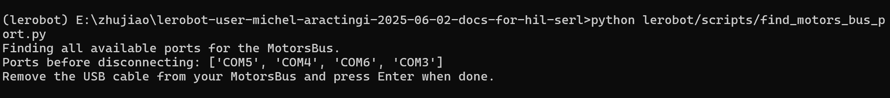

此时拔掉从臂usb接口按下回车会输出从臂的com id

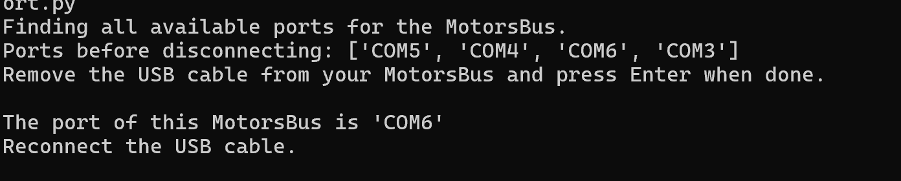

相同的操作同理也对主臂进行一次，此时我们记录下主臂与从臂的COM id

然后找到 路径lerobot-main\lerobot\common\robot_devices\robots的config.py文件

修改446和463行的主臂和从臂的接口ID

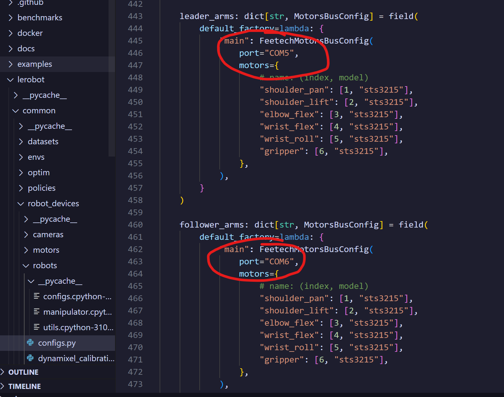


**7.在conda环境中安装pytorch*

首先查看自己电脑配置的显卡信息以及需要安装的版本

```
nvidia-smi
```

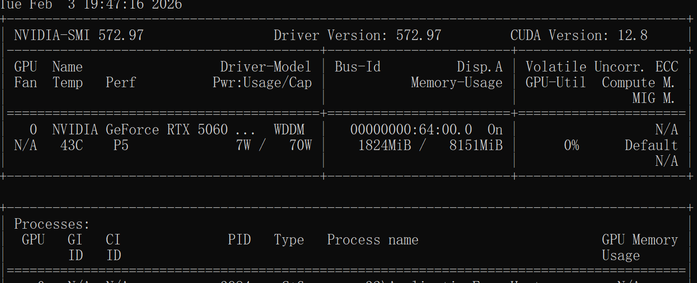

这里可以看到我的显卡是5060，需要安装的CUDA版本是12.8，则允许如下命令安装pytorch，每个人的版本号不一样需要将最后的cu改成自己显卡的cuda版本

```
pip install torch torchvision torchaudio --index-url https://download.pytorch.org/whl/cu128
```


#### 三. 对lerobot进行遥操作

首先执行如下代码

```
python lerobot/scripts/control_robot.py --robot.type=so101 --robot.cameras="{}" --control.type=calibrate --control.arms="[\"main_follower\"]"
```

然后会输出如下内容：

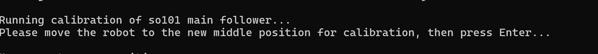

然后以此按照下图四个图依次手动摆好从臂的位置，摆好一个位置按一下回车

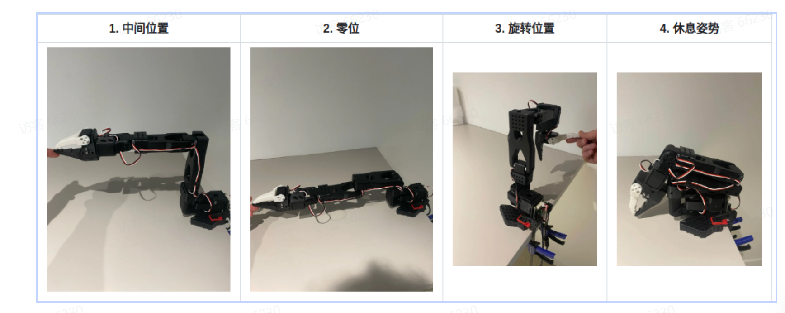

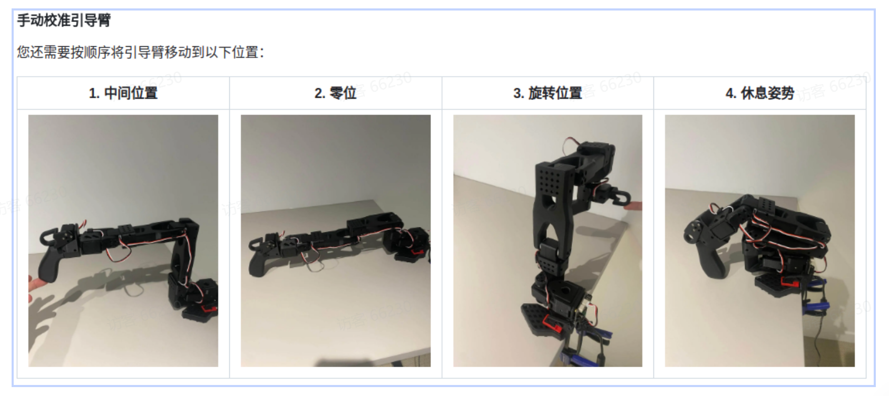

完成如下图，**注意：完成从臂的标注后会自动开始进行主臂的标注**

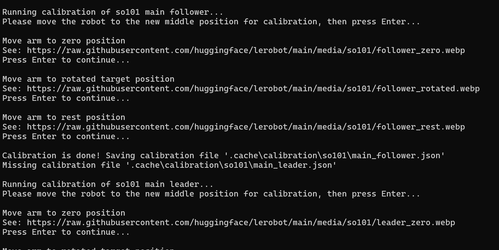


动作标定完成后，我们开始进行遥操作，指令如下：

```
python lerobot/scripts/control_robot.py --robot.type=so101 --control.type=teleoperate
```

执行完成后，我们用手操作主臂，从臂就会跟着主臂做一样的操作

### 四. 数据采集	

**相机配置**

执行如下代码，会调用电脑所连接的所有相机进行拍照

```
python lerobot/common/robot_devices/cameras/opencv.py  --images-dir outputs/images_from_opencv_cameras
```

拍摄的照片会以相机ID命名存储在outputs/images_from_opencv_cameras中，camera后面的数字就是id

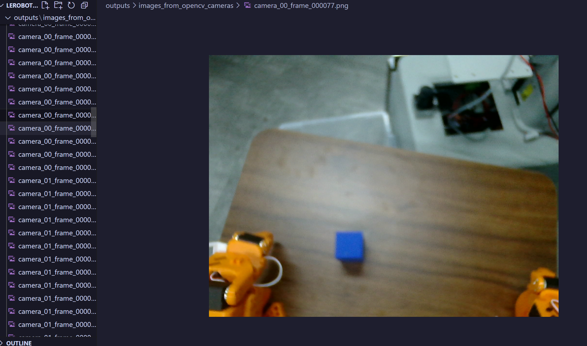

然后修改lerobot-main\lerobot\common\robot_devices\robots的config.py文件中的第480和486行 还有257行和263行，改成自己的相机id，laptop为顶视相机，phone为夹爪相机,并且取消原有484-490的注释

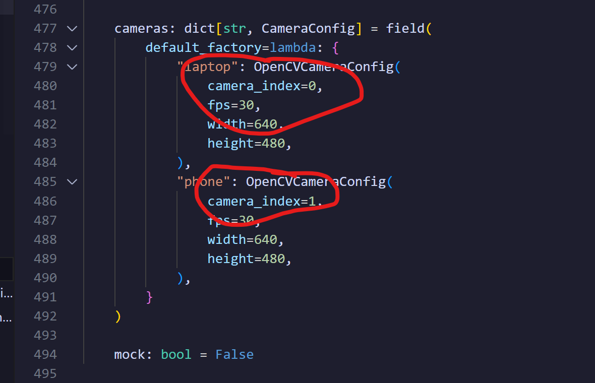

然后修改lerobot\common\robot_devices\cameras\opencv.py 的333行，将第333行代码注释掉之后再下面添加如下代码。

```
   #self.camera = cv2.VideoCapture(camera_idx, backend)  #把原来的注释掉
        self.camera = cv2.VideoCapture(camera_idx)
        self.camera.set(cv2.CAP_PROP_FOURCC, cv2.VideoWriter.fourcc("M", "J", "P", "G"))
        self.camera.set(cv2.CAP_PROP_FPS, 60)
```

执行下列代码进行数据采集，control.warmup_time_s=5是准备时间为5s，control.episode_time_s=15是数据录制时间为15s，control.reset_time_s=5是重置环境的时间，control.num_episodes=50是一次性采集数据的数量。

```
python lerobot/scripts/control_robot.py --robot.type=so101 --control.type=record --control.fps=30 --control.single_task="Grasp a lego block and put it in the bin." --control.repo_id=myuser/so101_lego_grasp --control.root=dataoutputs --control.warmup_time_s=5 --control.episode_time_s=15 --control.reset_time_s=5 --control.num_episodes=50 --control.display_data=true --control.push_to_hub=false --control.video=false
```

如果想要再数据集后增采集，需要在后面增加参数 control.resume=true

```
python lerobot/scripts/control_robot.py --robot.type=so101 --control.type=record --control.fps=30 --control.single_task="Grasp a lego block and put it in the bin." --control.repo_id=myuser/so101_lego_grasp --control.root=dataoutputs --control.warmup_time_s=5 --control.episode_time_s=15 --control.reset_time_s=5 --control.num_episodes=10 --control.display_data=true --control.push_to_hub=false --control.video=false --control.resume=true
```

如果想要删除废弃的数据，则需要删除这些内容并且更改相关参数：

1.删除废弃的数据

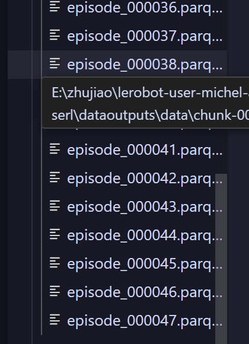

2.删除episodes_stats.jsonl和episodes.jsonl里的json对应的json文件

​		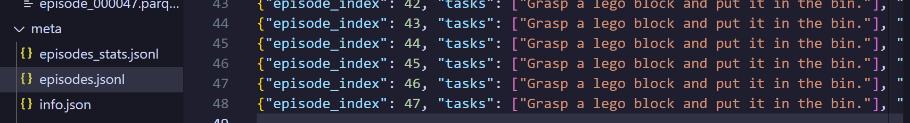

3.修改info.json里的"total_episodes","total_frames",和splits里的"train"参数

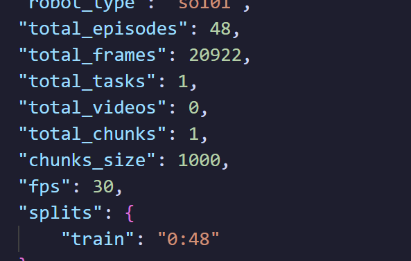


运行以下命令来验证数据集,如果终端打印数据集加载成功共多少个episodes,则表明数据加载成功。这里会跑得比较慢。

```
python -c "from lerobot.common.datasets.lerobot_dataset import LeRobotDataset; ds = LeRobotDataset('myuser/so101_lego_grasp', root='dataoutputs'); print(f'✅ 数据集加载成功！共 {ds.num_episodes} 个 episodes，{ds.num_frames} 帧')"

```

### 五. 模型训练

运行以下命令来进行模型训练：steps=100000是训练步数，步数越多越好，但是考虑到训练时间成本，我们就设置为10000步，batch_size值和num_workers值参考自己的电脑配置动态调整，policy.n_action_steps是预测未来动作的步数，大家也可以根据自己的算力自行调整

```
	python lerobot/scripts/train.py --dataset.repo_id="" --dataset.root=dataoutputs --policy.type=act --output_dir=outputs/train/act_lego_grasp --job_name=act_lego_grasp --policy.device=cuda --num_workers=2 --batch_size=8 --policy.n_obs_steps=1 --policy.n_action_steps=10 --policy.chunk_size=50 --steps=100000
```

参数说明：

dataset.repo_id=myuser/so101_lego_grasp：你的数据集
--dataset.root=dataoutputs：数据集路径
--policy.type=act：使用 ACT 策略
--output_dir=outputs/train/act_lego_grasp：训练输出目录
--policy.device=cuda：使用 GPU 训练（如果没有 GPU，改为 cpu）


### 六. 对训练完的模型在真机上进行推理验证

```
python lerobot/scripts/control_robot.py --robot.type=so101 --control.type=record --control.fps=30 --control.single_task="Grasp a lego block and put it in the bin." --control.repo_id=myuser/eval_act_lego_grasp --control.root=realoutputs --control.num_episodes=10 --control.warmup_time_s=2 --control.episode_time_s=30 --control.reset_time_s=10 --control.policy.path=outputs/train/act_lego_grasp/checkpoints/last/pretrained_model --control.push_to_hub=false --control.video=false

```

